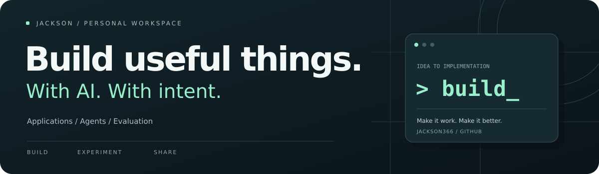

  

  <b>把 AI 的可能性，做成日常可用的工具。</b>

  <a href="#selected-work">精选项目</a> &nbsp; · &nbsp;
  <a href="#in-action">项目效果</a> &nbsp; · &nbsp;
  <a href="#experience">就职经历</a> &nbsp; · &nbsp;
  <a href="#writing">博客与联系</a>

 

我是 **Jackson**，关注 AI 应用开发、Agent 与 AI 辅助研发。  
喜欢从具体问题出发，把模型能力接入真实场景，让人与 AI 的协作更清晰、更可靠。

**常用语言** &nbsp; `Java` &nbsp; `TypeScript`  
**探索方向** &nbsp; `AI Applications` &nbsp; `Agents` &nbsp; `Evaluation` &nbsp; `Context Engineering`

 

## 01 &nbsp; Selected work
从对话应用到研发流程，再到可复核的效果评估。

<table>
<tr>
<td colspan="2" valign="top">

01 / AI SUPPORT EVALUATION

<h3><a href="https://github.com/Jackson366/erp-support-eval">ERP Support Eval ↗</a></h3>

<strong>让每条 ERP 客服回答，有据可查。</strong>

为面向已购云 ERP 客户的 AI 客服建立可复核评测，检查产品知识、租户与权限边界、操作建议和服务承诺。

提供电子行业 ERP 公开帮助文档案例与通用合成案例，共 18 个场景、36 份人工参考回答；支持五项硬性检查、原文证据校验和可搜索的离线报告。

<code>Python</code> <code>LLM Evaluation</code> <code>Customer Support</code>

<a href="https://github.com/Jackson366/erp-support-eval#readme">查看项目 →</a>
 · <a href="https://github.com/Jackson366/erp-support-eval/blob/main/README.zh-CN.md">中文说明</a>
 · <a href="https://github.com/Jackson366/erp-support-eval/releases/tag/v0.1.0">v0.1.0</a>

</td>
</tr>
<tr>
<td width="50%" valign="top">

02 / AI APPLICATION

<h3><a href="https://github.com/Jackson366/WeChat-AI">WeChat-AI ↗</a></h3>

<strong>让角色对话，发生在微信里。</strong>

自托管微信角色扮演对话服务，支持人设与记忆、图片理解、表情回复，以及可视化 Chatflow 编排。

从对话体验到用户中心、管理后台与多节点部署，探索 AI 应用的完整落地过程。

<code>Conversational AI</code> <code>Chatflow</code> <code>Self-hosted</code>

<a href="https://github.com/Jackson366/WeChat-AI#readme">查看项目 →</a>

</td>
<td width="50%" valign="top">

03 / AI DEVELOPMENT WORKFLOW

<h3><a href="https://github.com/Jackson366/bmad_prd">bmad_prd ↗</a></h3>

<strong>从一个想法，走向清晰的开发任务。</strong>

基于 BMAD-METHOD，探索 AI 驱动的敏捷研发流程，串联需求分析、PRD、架构设计与开发故事。

关注多角色 Agent 如何协作，以及上下文如何在规划、开发与验证之间有效传递。

<code>Agent Collaboration</code> <code>PRD</code> <code>Context Engineering</code>

<a href="https://github.com/Jackson366/bmad_prd#readme">查看项目 →</a>
 · <a href="https://github.com/bmad-code-org/BMAD-METHOD">BMAD-METHOD</a>

</td>
</tr>
</table>

 

## 02 &nbsp; In action
一个真实报告样例，两段应用场景演示。

### 高分，也可能不合格。
**ERP Support Eval** &nbsp; / &nbsp; 人工评测样例

客服回答正确解释了导入资料的限制，最后却额外承诺“五分钟内处理好”。已有资料没有这项服务承诺，因此触发硬性失败，高分也不能覆盖。

**首版内容**：18 个评测场景 · 36 份人工参考回答 · 5 项硬性检查。案例包括 BOM、账号权限、领料出库、反审批、资料缺失与流程冲突。

**验证范围**：41 项离线测试及两套案例校验通过；参考回答和评分为人工编写，实际客服效果仍需人工校准。

[运行演示](https://github.com/Jackson366/erp-support-eval#try-the-demo) · [接入自己的客服](https://github.com/Jackson366/erp-support-eval/blob/main/docs/erp-adoption-guide.md) · [发布版本](https://github.com/Jackson366/erp-support-eval/releases/tag/v0.1.0)

<strong>查看 WeChat-AI 对话演示</strong> · 虚构示例

> 以下对话与效果数据为虚构展示，不代表实际运行指标。

#### WeChat-AI / 一段有角色感的日常对话

| 场景 | 对话示例 |
| :--- | :--- |
| 用户输入 | 今天加班到好晚，有点累。 |
| 角色回复 | 辛苦啦，今天先给自己按个暂停键。要不要聊聊今天最让你头疼的事？ |
| 展示重点 | 角色语气 · 上下文衔接 · 表情回复 |

**效果摘要（虚构数据）**：50 位体验用户 · 累计 2,000 次对话 · 平均回复 3 秒  
[体验入口（占位）](https://example.com/wechat-ai) · [演示视频（占位）](https://example.com/wechat-ai-demo)

<strong>查看 bmad_prd 产出流程</strong> · 虚构示例

> 以下需求、产出与效果数据为虚构展示。

#### bmad_prd / 从一句需求到一组开发任务

**输入示例**：我想做一个支持多租户的任务管理系统。

| 阶段 | 产出示例 |
| :--- | :--- |
| 需求澄清 | 明确管理员、团队成员的角色与使用场景 |
| PRD 与架构 | 整理功能范围、权限边界与模块划分 |
| 开发故事 | 将需求拆成可实施、附带验收条件的任务 |
| 验证 | 根据验收条件逐项检查实现结果 |

**效果摘要（虚构数据）**：1 份 PRD · 6 个功能模块 · 18 条开发故事  
[查看产出样例（占位）](https://example.com/bmad-prd-example)

 

## 03 &nbsp; Experience
就职经历 · 以下公司、岗位、时间与工作内容均为虚构占位。

<table>
<tr>
<td width="23%" valign="top"> <strong>2024.07 — 至今</strong> 示例经历 01</td>
<td valign="top">
<h3>AI 应用开发工程师</h3>

<strong>示例科技 A</strong> · 虚构公司

参与企业 AI 助手与智能工作流开发，连接模型能力和业务系统。

<ul>
<li>负责对话服务、工具调用及上下文组织，完善日志与效果验证。</li>
<li>与产品团队协作，将业务需求拆解为可交付的开发任务。</li>
</ul>

<code>AI Applications</code> <code>Agent Workflows</code>

</td>
</tr>
<tr>
<td width="23%" valign="top"> <strong>2022.07 — 2024.06</strong> 示例经历 02</td>
<td valign="top">
<h3>Java 后端开发工程师</h3>

<strong>示例科技 B</strong> · 虚构公司

参与 SaaS 业务系统开发，负责接口、权限与数据处理模块。

<ul>
<li>优化服务稳定性与问题排查流程，补充接口文档和自动化检查。</li>
<li>推进公共能力复用，支持多个业务模块协作开发。</li>
</ul>

<code>Java</code> <code>SaaS</code> <code>Backend</code>

</td>
</tr>
</table>

 

## 04 &nbsp; Writing & contact
记录构建过程，也分享沿途的发现。

> 以下文章标题与联系方式均为示例；链接使用占位域名。

记录 AI 应用开发、Agent 实践和工程学习过程。

| 最近文章（虚构示例） | 主题 |
| :--- | :--- |
| [从一个聊天接口到可用的微信 AI 助手](https://example.com/blog/wechat-ai) | AI 应用实践 |
| [让 Agent 接住上下文：从 PRD 到开发故事](https://example.com/blog/agent-context) | 上下文工程 |
| [用 TypeScript 搭建最小 Agent Loop](https://example.com/blog/agent-loop) | 学习笔记 |

[个人博客（占位）](https://example.com/blog) · [邮箱（占位）](mailto:jackson@example.com) · [GitHub](https://github.com/Jackson366)

 

---

  <b>把想法做出来，把过程分享出来。</b> 
  BUILD WITH CURIOSITY · SHARE WITH CARE

